# Весь спектр 

MA= 0.8798879456334701

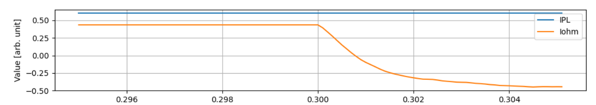

# Piece_1

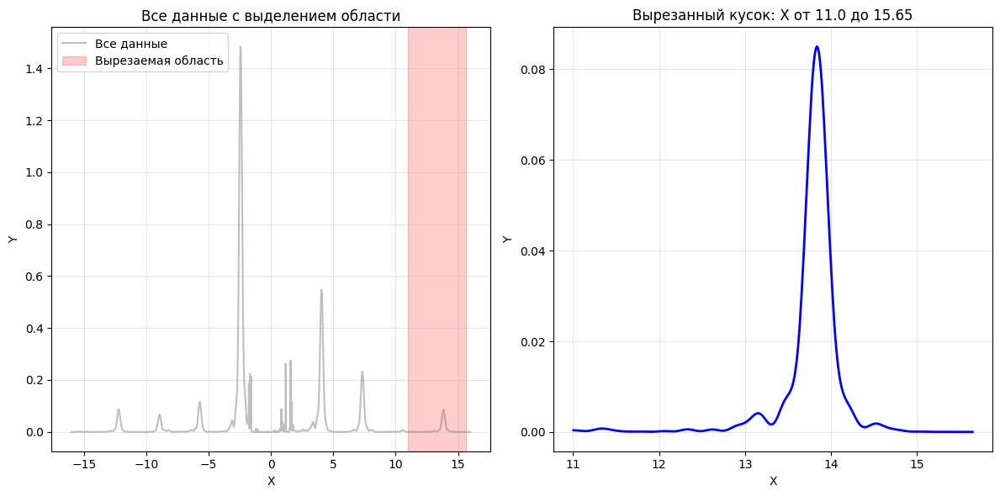

MA= -0.02297258656367

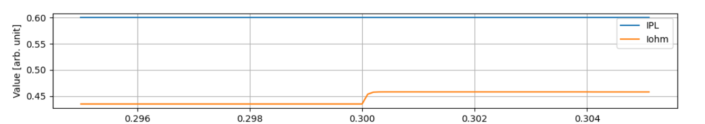

# Piece_2

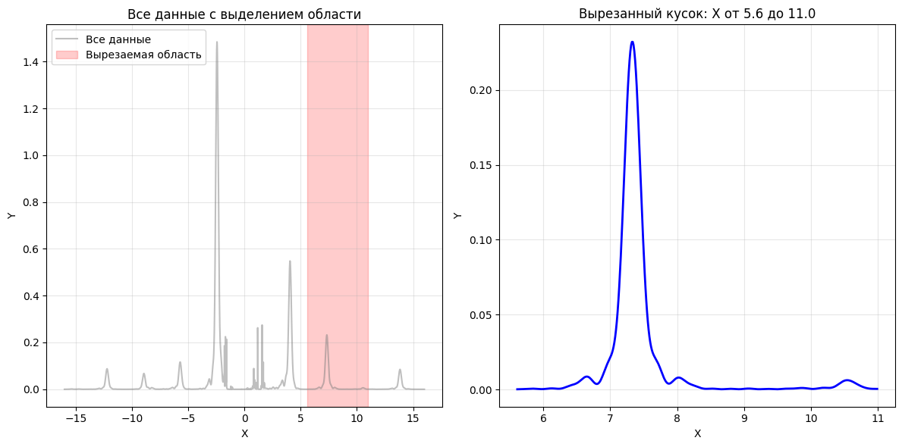

MA= -0.11040054210703

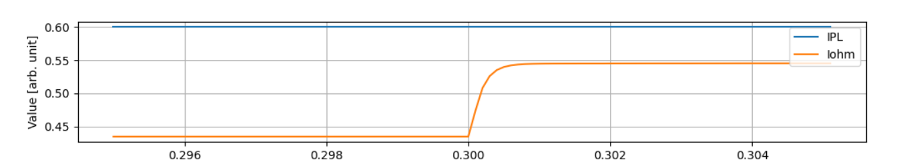

# Piece_3

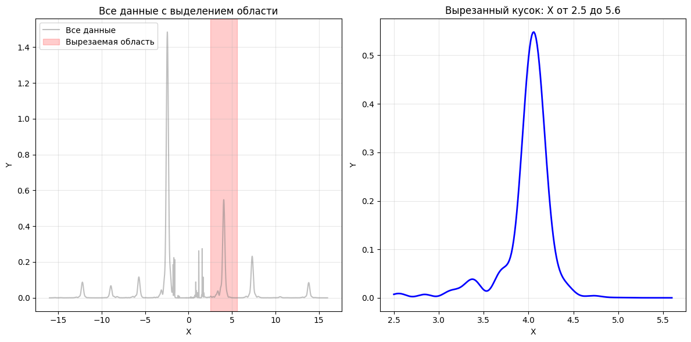

MA= -0.91889362731787

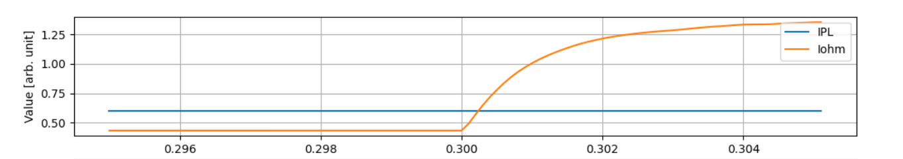

# Piece_4

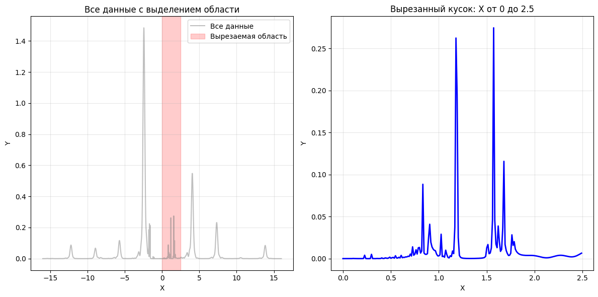

MA= -1.48284941846884

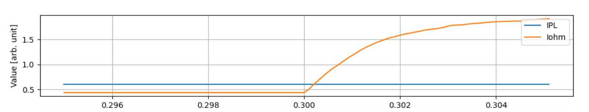

# Piece_positive_1

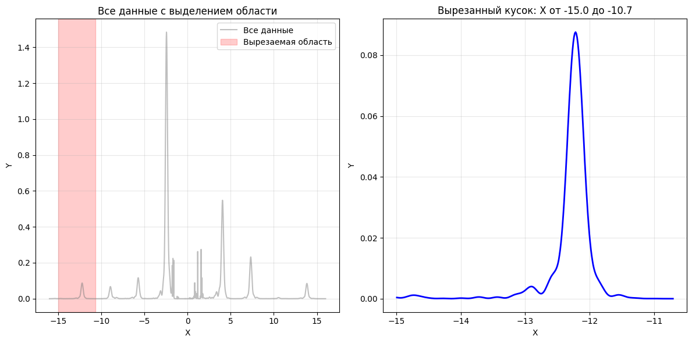

MA= 0.01886068762001

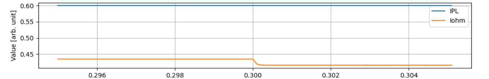

# Piece_positive_2

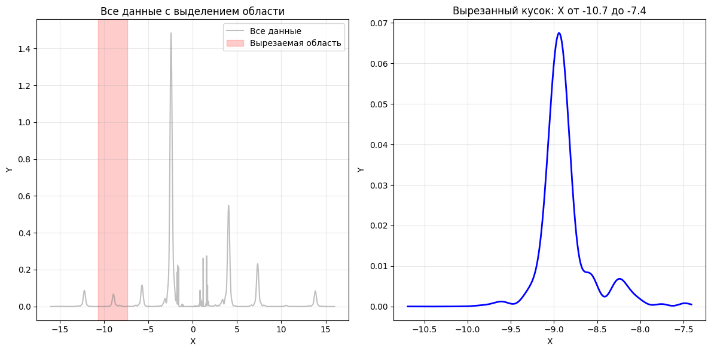

MA= 0.04203885830929

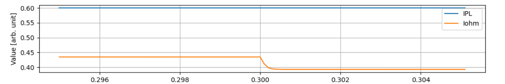

# Piece_positive_3

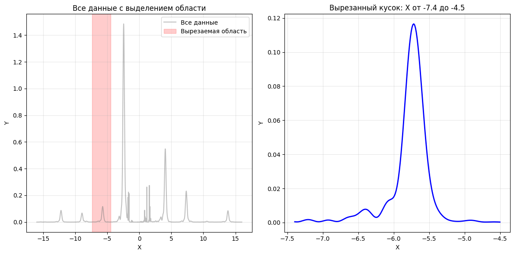

MA= 0.1724915194588

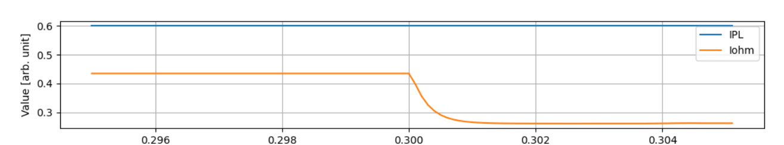

# A peak in positive 

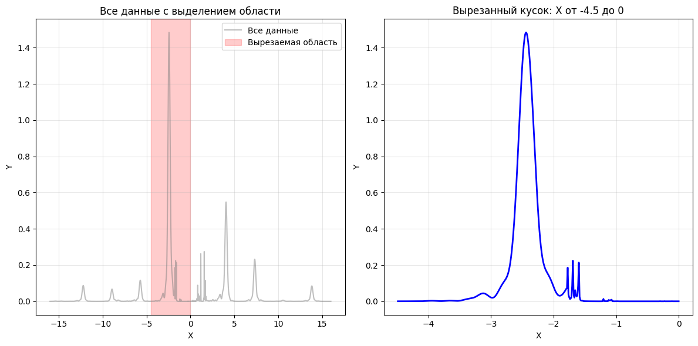

MA= 1.75408156444382

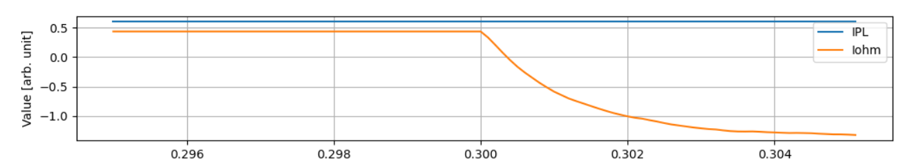 